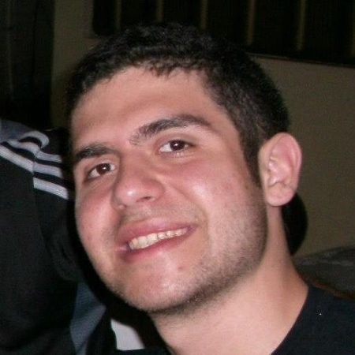

<h1 align="center">Projeto Sentinela</h1>

##

Sentinela é um projeto desenvolvido por alunos da Kenzie utilizando a tecnologia React.
Tem como finalidade **fornecer informações** sobre deputados federais de forma descomplicada e intuitiva.

 

# ✅ Tabela de Conteúdos

<!--ts-->

- [Status do Projeto](#status)
- [Tecnologias](#tecnologias)
- [Utilitários](#utilitarios)
- [Como rodar a aplicação](#aplicacao)
- [Contribuição](#contribuicao)

<!--te-->

 
<h1 id="status"> ✅ Status do Projeto </h1>

<h4 align="center"> 
	🚧  Sentinela 🚀 Em aprimoramento...  🚧
</h4>

<h1 id="tecnologias"> ✅ Tecnologias </h1>

#### **Tecnologias**

<!--ts-->

- React
  - Context - API
  - React - TypeScript
- CRA
- Styled Components
- Material UI
- React Toastify
- Axios
- JWT - token
- React-router-dom
- React-hook-form
- Yup
- @resolvers/yup
- json-server-auth
- React-multi-carousel

<!--te-->

 

## **Server** ([Api][dados abertos])

- link para a API ( https://dadosabertos.camara.leg.br/api/v2/ )
   

### **EndPoints Utilizados**

     /deputados
     /proposicoes

## **Server** ([Api] [sentinela-server])

- link para a API ( https://sentinela.herokuapp.com/ )

### **EndPoints Utilizados**

     /login
     /register

<h1 id="utilitarios"> ✅ Utilitários </h1>

<!--ts-->

- [Commit Conventional](https://www.conventionalcommits.org/en/v1.0.0/)
- [Teste de API (Insomnia)](https://insomnia.rest/download)
- [Protótipo (Figma)](https://www.figma.com/file/FdqesTtxkJWVz95Xh4HwOH/Sentinela?node-id=0%3A1)
- [Editor (Visual Studio Code)](https://code.visualstudio.com/download)
- [Plataforma para a hospedagem (vercel)](https://vercel.com)
- [Trello](https://trello.com/b/j8434i7n/capstone)

<!--te-->

<h1 id="aplicacao"> ✅ Como rodar a aplicação </h1>

## Pré-requisitos

Antes de começar, você vai precisar ter instalado em sua máquina as seguintes ferramentas:
Git, Node.js, yarn.

 

## Instalando yarn via npm

É recomendável instalar o Yarn por meio do gerenciador de pacotes npm , que vem junto com o Node.js quando você o instala em seu sistema.

 

Depois de instalar o npm, você pode executar o seguinte para instalar e atualizar o Yarn:

     npm install --global yarn

### Verifique a instalação

Verifique se o Yarn está instalado executando:

    yarn --version

## Clonando o repositório do Gitlab

    $ git clone https://gitlab.com/Itallo_Dornelas/sentinela.git

## Acesse o projeto no terminal/cmd

    $ cd sentinela

## Abra no Visual Studio Code

    $ code .

## No diretório do projeto, você pode executar:

### `yarn`

para atualizar o **package.json**

### `yarn start`

Executa o aplicativo no modo de desenvolvimento.

Abra [http://localhost:3000](http://localhost:3000) para visualizá-lo no navegador.

A página será recarregada se você fizer edições. \
Você também verá quaisquer erros de lint no console.

### `yarn test`

Inicia o executor de teste no modo de observação interativo. \
Veja a seção sobre [running tests](https://facebook.github.io/create-react-app/docs/running-tests) para maiores informações.

 

 

<h1 id="contribuicao">  ✅ Contribuição </h1>

 <table style="width:100%">
 <tr>
    <th><strong>Amanda Medeiros</strong></th>
    <th><strong>Ioane Faumui</strong></th>
    <th><strong>Itallo Dornelas</strong></th>
    <th><strong>João Alves</strong></th>
    <th><strong>Lucas Rocha</strong></th>
    <th><strong>Rafael Monteiro</strong></th>
  </tr>
  <tr align="center">
    <td aling=center>
      
    </td>
    <td>
      
    </td>
    <td>
      
    </td>
    <td>
      
    </td>
    <td>
      
     </td>
      <td>
      
     </td>
   </tr>
 </table>

